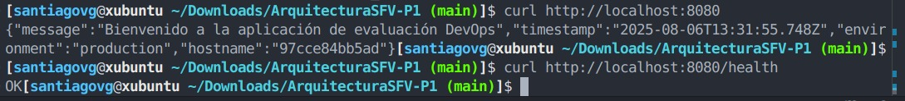

# ArquitecturaSFV-P1

# Evaluación Práctica - Ingeniería de Software V

## Información del Estudiante
- **Nombre: Santiago Valencia García**
- **Código: A00395902**
- **Fecha: 06 de agosto de 2025**

## Resumen de la Solución
Esta solución implementa una aplicación Node.js contenerizada usando Docker, con un script de automatización que demuestra principios DevOps fundamentales. La aplicación expone dos endpoints: uno principal que retorna información del sistema y otro para health checks.

## Dockerfile

### Decisiones Técnicas Tomadas

1. **Imagen Base (`node:18-alpine`)**
   - **Ventaja**: Imagen ligera (~100MB vs 300MB+ versiones completas)
   - **Ventaja**: Node.js 18 LTS garantiza estabilidad
   - **Ventaja**: Alpine Linux es seguro y minimalista

2. **Estrategia de Caching**
   - Copiamos `package.json` antes que el código fuente
   - Aprovecha Docker layer caching
   - Reinstala dependencias solo cuando cambia package.json

3. **Seguridad**
   - Usuario no-root (`nextjs:nodejs`)
   - Instalación solo de dependencias de producción
   - Principio de menor privilegio

4. **Optimización**
   - Multi-stage implícito con orden de COPY
   - Reduce rebuilds innecesarios
   - Imagen final más pequeña

## Script de Automatización

### Funcionalidades Implementadas

El script `deploy.sh` automatiza completamente el proceso de despliegue:

1. **Verificaciones Previas**
   - Verifica instalación de Docker
   - Confirma que Docker daemon está ejecutándose
   - Valida versión de Docker

2. **Limpieza Automática**
   - Detiene contenedores anteriores
   - Elimina imágenes obsoletas
   - Previene conflictos de nombres/puertos

3. **Construcción y Despliegue**
   - Build automático de imagen Docker
   - Ejecución con variables de entorno correctas
   - Configuración automática de puertos

4. **Validación y Monitoreo**
   - Tests de conectividad (curl)
   - Health checks automáticos
   - Reporte de estado detallado

5. **Experiencia de Usuario**
   - Output con colores para mejor legibilidad
   - Mensajes informativos y de error claros
   - Comandos útiles para gestión post-despliegue

## Principios DevOps Aplicados

### 1. **Automatización (Automation)**
- **Implementación**: Script bash que automatiza todo el pipeline
- **Beneficio**: Elimina errores manuales y acelera despliegues
- **Evidencia**: Deploy completo con un solo comando `./deploy.sh`

### 2. **Infraestructura como Código (IaC)**
- **Implementación**: Dockerfile define infraestructura de manera declarativa
- **Beneficio**: Entornos reproducibles y versionables
- **Evidencia**: Misma imagen funciona en cualquier entorno con Docker

### 3. **Monitoreo y Observabilidad**
- **Implementación**: Health checks y logging integrados
- **Beneficio**: Detección temprana de problemas
- **Evidencia**: Endpoint `/health` y logs de contenedor accesibles

### 4. **Integración Continua**
- **Implementación**: Build y test automáticos en cada ejecución
- **Beneficio**: Feedback rápido sobre cambios
- **Evidencia**: Script valida funcionamiento antes de completar

### 5. **Contenerización**
- **Implementación**: Aplicación completamente dockerizada
- **Beneficio**: Consistencia entre entornos (dev/prod)
- **Evidencia**: "Funciona en mi máquina" ya no es problema


## Captura de Pantalla



## Mejoras Futuras
1. Pipeline CI/CD Completo

- Descripción: Implementar GitHub Actions o GitLab CI
- Beneficios:

    - Despliegue automático en push/merge
    - Tests automatizados
    - Deploy a múltiples entornos (staging/prod)


Tecnologías: GitHub Actions, Jenkins, GitLab CI

2. Monitoreo y Métricas Avanzadas

- Descripción: Integrar Prometheus + Grafana
Beneficios:

    - Métricas de aplicación en tiempo real
    - Alertas proactivas
    - Dashboards de observabilidad


Tecnologías: Prometheus, Grafana, ELK Stack

3. Orquestación con Kubernetes

- Descripción: Migrar a Kubernetes para producción
- Beneficios:

    - Escalado automático horizontal
    - Alta disponibilidad
    - Rolling updates sin downtime
    - Service discovery automático


Tecnologías: Kubernetes, Helm, Istio

4. Seguridad Mejorada

- Descripción: Implementar security scanning y hardening
- Beneficios:

    - Escaneo de vulnerabilidades en imágenes
    - Secrets management
    - Network policies


Tecnologías: Trivy, Vault, OPA Gatekeeper

## Instrucciones para Ejecutar
### Prerrequisitos
```bash
# Instalar Docker (si no está instalado)
curl -fsSL https://get.docker.com -o get-docker.sh
sudo sh get-docker.sh

# Iniciar Docker daemon
sudo systemctl start docker
sudo systemctl enable docker

# Agregar usuario al grupo docker (opcional, evita sudo)
sudo usermod -aG docker $USER
# Cerrar y abrir sesión para aplicar cambios
```

### Ejecución Automática
```bash
# Clonar repositorio
git clone [URL_DE_TU_REPO]
cd ArquitecturaSFV-P1

# Ejecutar script de automatización
./deploy.sh
```

### Ejecución Manual
```bash
# 1. Construir imagen
docker build -t devops-evaluation-app .

# 2. Ejecutar contenedor
docker run -d \
  --name devops-app-container \
  -p 8080:3000 \
  -e NODE_ENV=production \
  -e PORT=3000 \
  devops-evaluation-app

# 3. Verificar funcionamiento
curl http://localhost:8080
curl http://localhost:8080/health
```

